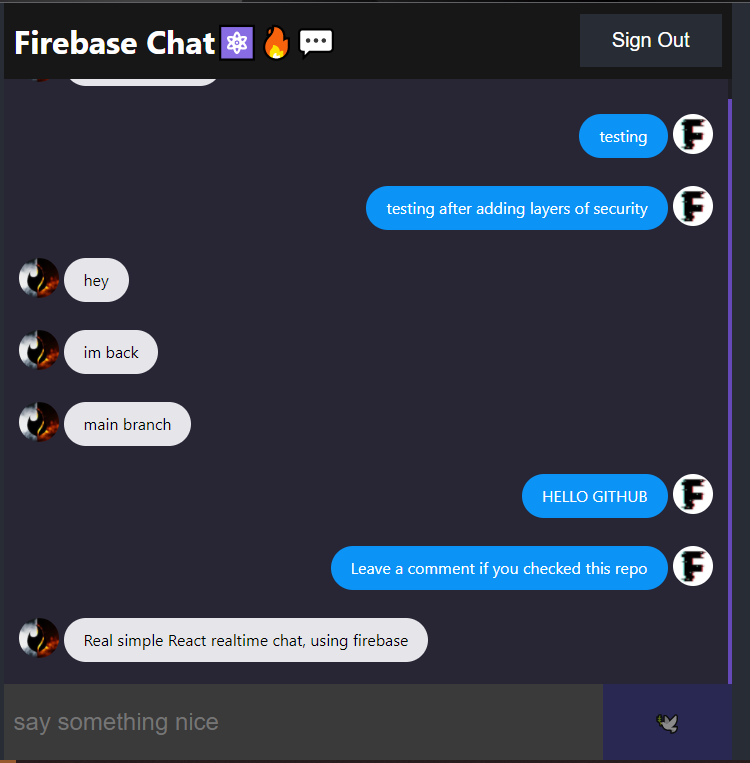

# React-Firebase-Chat-App
This is a real time chat app using React and firebase(backend app) for storing messages, it has bad-words protection filter(evil users) and sign-in google authentication
## App review

## Available Scripts

In the project directory, you can run:

### `npm run start`
This commando will run the client
